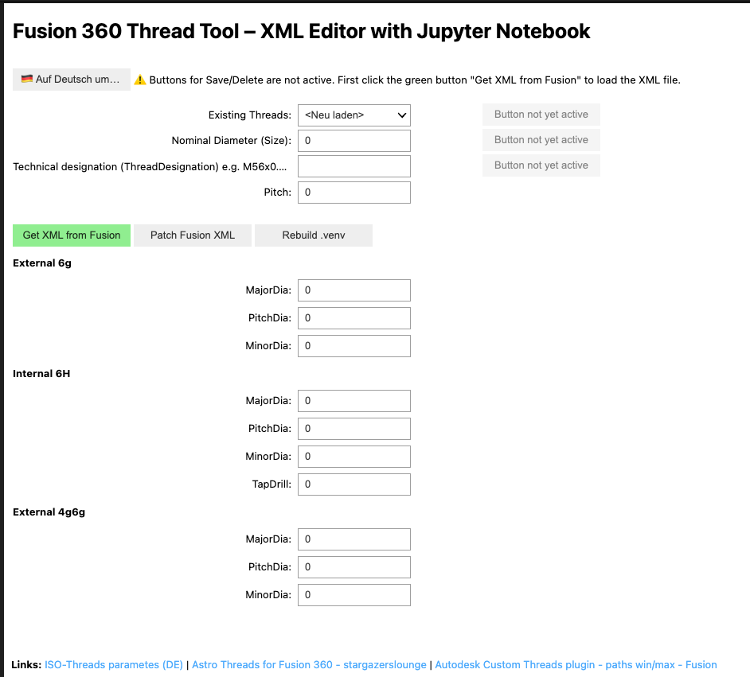

# Fusion 360 Thread Tool – XML Editor with Jupyter Notebook

⚠️ **Important Notes:**
1. Fusion 360 can remain open, you just need to restart the Thread Tool inside it.
2. The path / UID is configured automatically – see [After a Fusion Reinstall](#after-a-fusion-reinstall) below.

This tool allows convenient editing of Fusion 360 thread XML files directly inside a Jupyter Notebook.

   Please refer to this Autodesk article for details:  
     https://www.autodesk.com/support/technical/article/caas/sfdcarticles/sfdcarticles/Custom-Threads-in-Fusion-360.html

   You can use a website like this (DE) to get the numbers:
   - https://github.com/apos/fusion_360_threadtool_xml_editor
 
  Thanks also to Paul Gerlach
   - https://stargazerslounge.com/topic/346425-astro-threads-for-fusion-360/



## After a Fusion Reinstall

Fusion 360 generates a new unique installation ID (UID) with every update or reinstall.
The script `bin/update_fusion_threaddata.sh` automates all necessary steps:

1. **Auto-detects** the current Fusion 360 UID inside `~/Library/Application Support/Autodesk/webdeploy/production/`
2. **Updates** `config_fusion_threaddata_path.ini` with the new UID
3. **Copies** all custom thread XML files from `data/` into Fusion's `ThreadData` directory

```bash
bash bin/update_fusion_threaddata.sh
```

Then restart Fusion 360 (or just the Thread Tool inside it) to reload the thread data.

> **Tip:** Adding new custom thread types is easy – just place the `.xml` file in the `data/` folder
> and re-run the script. It will be deployed automatically on the next run.

---

## Features

✅ Export XML files from Fusion 360  
✅ View and edit existing thread entries  
✅ Add new thread entries  
✅ Delete thread entries  
✅ Write changes back to the XML file  
✅ Remove blank lines from the XML  
✅ Switch language DE ↔ EN

## Usage

1. Start the Jupyter Notebook:
    ```bash
    jupyter notebook
    ```

2. Load the notebook file and run the cells.

3. Use the buttons:
    - **Get XML from Fusion** → Export XML
    - **Patch Fusion XML** → Apply changes to XML
    - **Rebuild .venv** → Rebuild the virtual environment

4. Use the dropdown to load existing threads.

5. Fill in the fields or adjust values.

6. Save:
    - **Save** → overwrite existing entry
    - **Save as New** → create a new entry (`_neu`)

7. Use **Switch to English / Auf Deutsch umschalten** to change the language.

## Requirements

- Python 3.x
- Jupyter Notebook
- ipywidgets

Example installation:

```bash
# Create/rebuild the virtual environment (once):
bash bin/create_venv.sh

# Or manually:
pip install -r bin/requirements.txt
```

## Directory Structure

```
├── bin
│   ├── create_venv.sh              # Create/rebuild Python virtual environment
│   ├── requirements.txt
│   ├── update_fusion_threaddata.sh # ← Run after every Fusion reinstall!
│   └── sync_xml.sh
├── config_fusion_threaddata_path.ini  # Auto-updated UID + path template
├── data
│   ├── AstroISOmetric.xml          # Custom thread definition (source of truth)
│   ├── AstroISOmetric.xml.bak
│   ├── image_de.png
│   └── image.png
├── fusion360_thread_editor.ipynb
├── README_DE.md
└── README.md
```

---

© 2025 github.com/apos