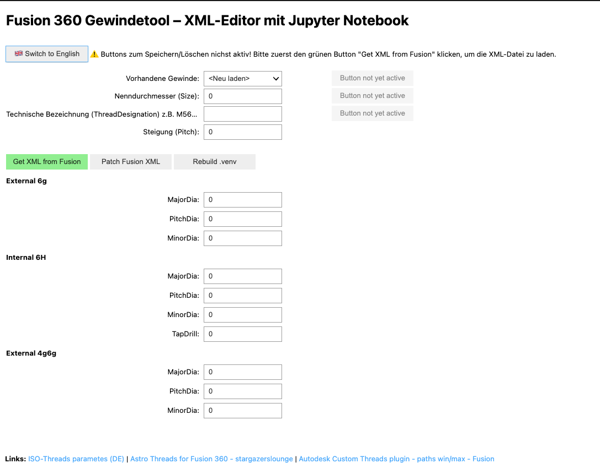

# Fusion 360 Gewindetool – XML-Editor mit Jupyter Notebook

> **KI-Nutzer:** Siehe [Readme_For_AI_Usage.md](Readme_For_AI_Usage.md) für eine Schritt-für-Schritt-Anleitung, wie man Gewinde mit KI-Unterstützung hinzufügt und anpasst.

⚠️ **Wichtige Hinweise:**
1. Fusion kann an sein, man muss nur das Thread-Tool neu starten.
2. Pfad und UID werden automatisch ermittelt – siehe [Nach einer Fusion-Neuinstallation](#nach-einer-fusion-neuinstallation) weiter unten.

   Details zu Custom Threads in Fusion 360:
   - https://www.autodesk.com/support/technical/article/caas/sfdcarticles/sfdcarticles/Custom-Threads-in-Fusion-360.html

   Man kann diese Webseite (DE) zur Berechnung verwenden:
   - https://github.com/apos/fusion_360_threadtool_xml_editor
 
   Dank auch an Paul Gerlach
   - https://stargazerslounge.com/topic/346425-astro-threads-for-fusion-360/
  
   Danke an 

Dieses Tool ermöglicht die komfortable Bearbeitung von Gewinde-XML-Dateien für Fusion 360 direkt in einem Jupyter Notebook.



## Nach einer Fusion-Neuinstallation

Fusion 360 vergibt bei jedem Update oder jeder Neuinstallation eine neue eindeutige Installations-ID (UID).
Das Skript `bin/update_fusion_threaddata.sh` automatisiert alle nötigen Schritte:

1. **Erkennt automatisch** die aktuelle Fusion-360-UID in `~/Library/Application Support/Autodesk/webdeploy/production/`
2. **Aktualisiert** die `config_fusion_threaddata_path.ini` mit der neuen UID
3. **Kopiert** alle Custom-Thread-XML-Dateien aus `data/` in das `ThreadData`-Verzeichnis von Fusion

```bash
bash bin/update_fusion_threaddata.sh
```

Danach Fusion 360 (oder nur das Thread-Tool darin) neu starten, damit die Gewinde-Daten neu geladen werden.

> **Tipp:** Neue Custom-Gewindetypen lassen sich ganz einfach hinzufügen – einfach die `.xml`-Datei
> in den `data/`-Ordner legen und das Skript erneut ausführen. Sie wird beim nächsten Lauf automatisch deployt.

---

## Funktionen

✅ XML-Dateien aus Fusion 360 exportieren  
✅ Vorhandene Gewindeeinträge anzeigen und bearbeiten  
✅ Neue Gewindeeinträge hinzufügen  
✅ Gewindeeinträge löschen  
✅ Änderungen direkt ins XML zurückschreiben  
✅ Leere Zeilen aus der XML entfernen  
✅ Sprachumschaltung DE ↔ EN

## Bedienung

1. Starte das Jupyter Notebook mit:
    ```bash
    jupyter notebook
    ```

2. Lade die Notebook-Datei und führe die Zellen aus.

3. Nutze die Buttons:
    - **Get XML from Fusion** → XML exportieren
    - **Patch Fusion XML** → Änderungen ins XML schreiben
    - **Rebuild .venv** → virtuelle Umgebung neu erstellen

4. Nutze das Dropdown, um vorhandene Gewinde zu laden.

5. Fülle die Felder aus oder passe Werte an.

6. Speichere:
    - **Speichern** → überschreibt existierenden Eintrag
    - **Als neu speichern** → legt neuen Eintrag an (`_neu`)

7. Mit **Switch to English / Auf Deutsch umschalten** kannst du die Sprache wechseln.

## Voraussetzungen

- Python 3.x
- Jupyter Notebook
- ipywidgets

Installation (Beispiel):

```bash
# Virtuelle Umgebung erstellen/neu aufbauen (einmalig):
bash bin/create_venv.sh

# Oder manuell:
pip install -r bin/requirements.txt
```

## Verzeichnisstruktur

```
├── bin
│   ├── create_venv.sh              # Python-Virtualenv erstellen/neu aufbauen
│   ├── requirements.txt
│   ├── update_fusion_threaddata.sh # ← Nach jeder Fusion-Neuinstallation ausführen!
│   └── sync_xml.sh
├── config_fusion_threaddata_path.ini  # Automatisch aktualisierte UID + Pfad-Template
├── data
│   ├── AstroISOmetric.xml          # Custom-Gewinde-Definition (Quelle der Wahrheit)
│   ├── AstroISOmetric.xml.bak
│   ├── image_de.png
│   └── image.png
├── fusion360_thread_editor.ipynb
├── README_DE.md
└── README.md
```

---

© 2025 github.com/apos