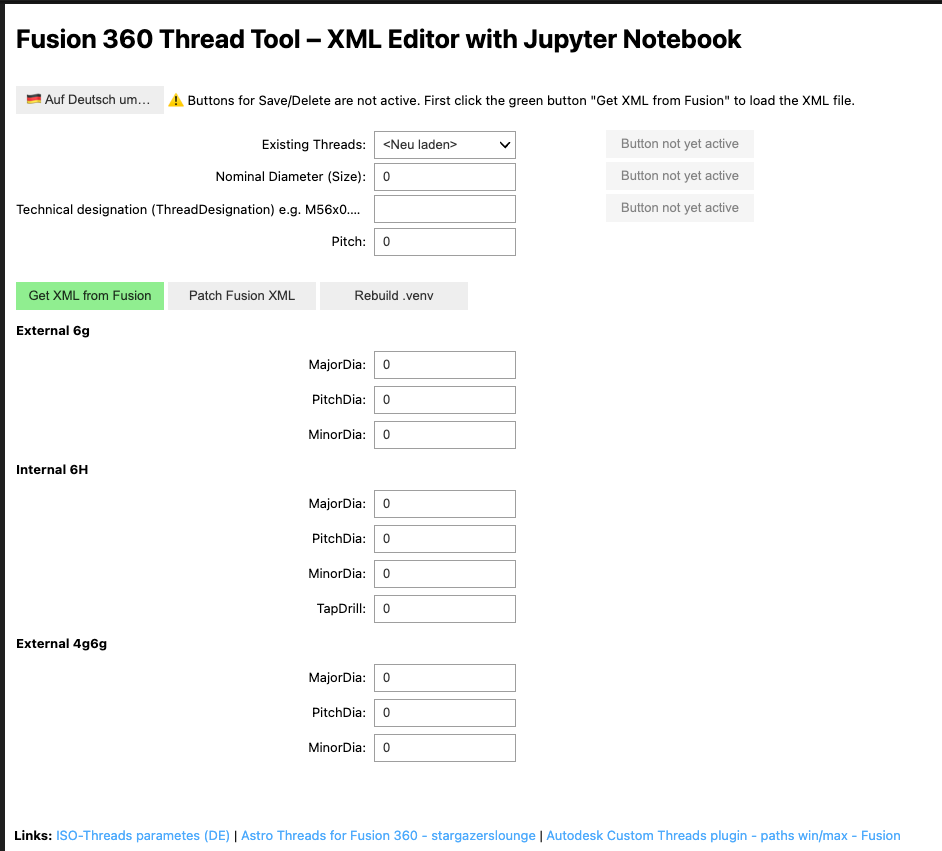

# Fusion 360 Gewindetool – XML-Editor mit Jupyter Notebook

⚠️ **Wichtige Hinweise:**  
1. Fusion 360 muss vor der Benutzung dieses Tools geschlossen sein.  
2. Der Pfad `FUSION_PATH` in `sync_xml.sh` muss korrekt auf den Fusion 360 XML-Ordner zeigen.  
3. Setze die Variable `FUSION_PATH` in `sync_xml.sh` auf den richtigen XML-Pfad:
   
   Beispiel (Mac):
   FUSION_PATH="/Users/yourname/Library/Application Support/Autodesk/webdeploy/production/.../ThreadData/Metric.xml"

   Hinweis: Der Pfad unterscheidet sich auf Windows und Mac. Details findest du hier:
   https://www.autodesk.com/support/technical/article/caas/sfdcarticles/sfdcarticles/Custom-Threads-in-Fusion-360.html

Dieses Tool ermöglicht die komfortable Bearbeitung von Gewinde-XML-Dateien für Fusion 360 direkt in einem Jupyter Notebook.



## Funktionen

✅ XML-Dateien aus Fusion 360 exportieren  
✅ Vorhandene Gewindeeinträge anzeigen und bearbeiten  
✅ Neue Gewindeeinträge hinzufügen  
✅ Gewindeeinträge löschen  
✅ Änderungen direkt ins XML zurückschreiben  
✅ Leere Zeilen aus der XML entfernen  
✅ Sprachumschaltung DE ↔ EN

## Bedienung

1. Starte das Jupyter Notebook mit:
    ```bash
    jupyter notebook
    ```

2. Lade die Notebook-Datei und führe die Zellen aus.

3. Nutze die Buttons:
    - **Get XML from Fusion** → XML exportieren
    - **Patch Fusion XML** → Änderungen ins XML schreiben
    - **Rebuild .venv** → virtuelle Umgebung neu erstellen

4. Nutze das Dropdown, um vorhandene Gewinde zu laden.

5. Fülle die Felder aus oder passe Werte an.

6. Speichere:
    - **Speichern** → überschreibt existierenden Eintrag
    - **Als neu speichern** → legt neuen Eintrag an (`_neu`)

7. Mit **Switch to English / Auf Deutsch umschalten** kannst du die Sprache wechseln.

## Voraussetzungen

- Python 3.x
- Jupyter Notebook
- ipywidgets

Installation (Beispiel):

```bash
pip install -r requirements.txt
```

## Verzeichnisstruktur

```
data/
 └─ AstroISOmetric.xml
bin/
 └─ sync_xml.sh
 └─ create_venv.sh
notebooks/
 └─ fusion360_thread_editor.ipynb
```

---

© 2025 github.com/apos